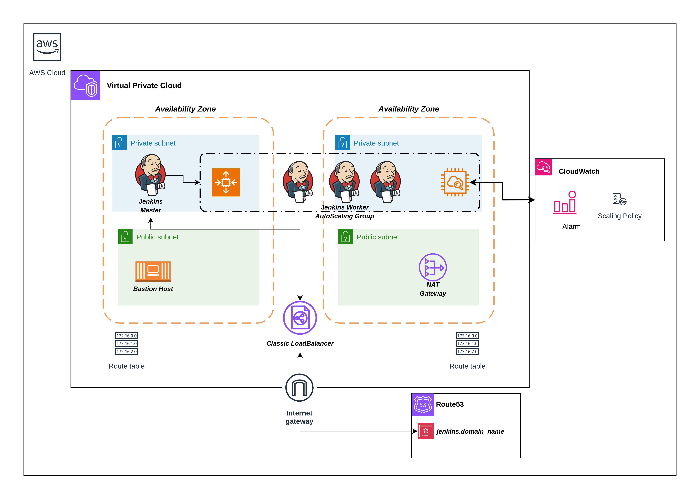

# Deploying a High-Availability Jenkins Cluster with Terraform

In here, we will now use Terraform to do the following:
- automate the creation of the Jenkins master and worker instances from the AMIs
- create AWS resources that will enable the cluster to be highly available; Auto-Scaling Groups, a LoadBalancer and a Bastion host (I will add code for using an OpenVPN ami as a bastion, eventually) and the essential AWS resources needed to host a the application.

## CheckList
- [ ] Create AWS environment; VPC, Subnets, IGW, Route tables, NAT Gateway ... etc
- [ ] Setting up a self-healing Jenkins master
- [ ] Setting up the dynamically scaling Jenkins workers

## Infrastructure Architecture
*This is the architecture deployed by Terrafrom*


## Setting Up the AWS Environment
To start deploying the Jenkins instances into AWS, we need to create a new Virtual Private Cloud aside the default one. This is to isolate the Jenkins instances from any workloads that might be deployed in the default or any other VPC.
I will now proceed to describe what is in each Terraform file:
- the `01-networking.tf` file contains code to set up Terraform with the AWS provider, create a new VPC, create four subnets (2 public, 2 private) and place them in pairs in two Availability Zones, an Internet gateway to route traffic to the internet, public and private route tables for each kind of subnet, a NAT gateway for the private subnets.
- the `02-bastion.tf` file contains Terraform code to configure the Bastion host to which we can connect and talk to the instances in the private subnets. It contains a specific AMI, an SSH key pair and a security group that allows SSH traffic into it making it ready for secure remote access to other instances in the VPC.
- the `03-jenkins_master.tf` file contains code that creates a security group for the Jenkins master instance, makes available the SSH port to the bastion host and takes ingress on port 8080 from anywhere, uses the Jenkins master AMI to provision the Jenkins master instance. An SSH key is added to the instance so that the Bastion can SSH into the master instance.
- the `04-elb.tf` file contains code to provision an Elastic Loadbalancer that accepts traffic on port 80 and forwards it to the Jenkins master instance on port 8080. 
- the `05-jenkins_worker.tf` file contains code the provisions Jenkins worker instances in an AutoScaling Group that depend on the master instance and the ELB being active at the time of provisioning. It also includes a template file to use in joining the worker instances to the master instance network.
- the `06-cloudwatch_scaling.tf` file contains code that creates a scaling policy using CloudWatch. The policy monitors the CPU utilization metric and uses that as a catalyst for scaling the Jenkins worker instances in the AutoScaling Group.

## Tips
- In the `04-elb.tf` file, I have a configured the ELB to use a Route53 Hosted Zone that uses SSL/HTTPS connections to connect to the Master Jenkins URL. In order to do this, you need to have an SSL Certificate provided by Amazon from ACM. You can do without this if you want to and still have SSL/HTTPS connections to the master instance. 

## Provisioning the Infrastructure
- Look through the variables and output files and modify the defaults and values to suit your preference. I suggest keeping the default values of the Jenkins master and worker instances though.
- You need to successfully integrate you AWS credentials like in running the Packer Configuration.
- Initialize the template with:
```bash
terraform init
```
- Validate the infrastructure configuration with:
```bash
terraform validate
```
- Plan the configuration with:
```bash
terraform plan
```
in here, you will be prompted to input some values, press 'Enter' to skip them. These will be provisioned with script when the infrastructure is being created.
- Apply the infrastructure configuration with:
```bash
terrafrom apply
```
in here, you will be prompted again to input some values, press 'Enter' to skip them. These will be provisioned with script when the infrastructure is being created.